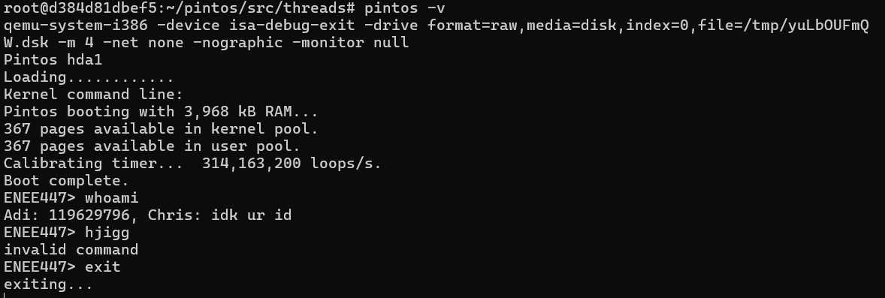

# Project 0: Getting Real

## Preliminaries

> Fill in your name and email address.

Christopher Cho <ccho920@umd.edu> Adithya Satheesh <adisat@umd.edu>

> Please cite any offline or online sources you consulted while preparing your
> submission, other than the Pintos documentation, course text, lecture notes,
> and course staff.

## Debugging

#### QUESTIONS: BIOS

> B1: What is the first instruction that gets executed? 
ljmp $0x3630,$0xf000e05b

> B2: At which physical address is this instruction located? 
0xFFFF0

#### QUESTIONS: BOOTLOADER

> B3: How does the bootloader read disk sectors? In particular, what BIOS
> interrupt is used?
The BIOS interrupt the *int $0x13* instructions is used (loader.S:242) and reads disk sectors with the *mov $0x42, %ah* instruction (loader.S:240)

> B4: How does the bootloader decides whether it successfully finds the Pintos
> kernel?
The bootloader checks seaches partition entries in the partition tables and checks if the partition is not empty (loader.S:74), the partition type is 0x20 (loader.S:81), and the bootable flag is set (loader.S:85).

> B5: What happens when the bootloader could not find the Pintos kernel?
Prints an error message (loader.S:103) and notifies the BIOS of boot failure (loader.S:107).

> B6: At what point and how exactly does the bootloader transfer control to the
> Pintos kernel?
At (loader.S:163) after successfully loading all kernel sectors into memory.

#### QUESTIONS: KERNEL

> B7: At the entry of pintos_init(), what is the value of expression
> `init_page_dir[pd_no(ptov(0))]` in hexadecimal format?

0x0

> B8: When `palloc_get_page()` is called for the first time,

>> B8.1 what does the call stack look like?

#0  palloc_get_page (flags=(PAL_ASSERT | PAL_ZERO)) at ../../threads/palloc.c:113
#1  0xc00203aa in paging_init () at ../../threads/init.c:168
#2  0xc002031b in pintos_init () at ../../threads/init.c:100
#3  0xc002013d in start () at ../../threads/start.S:180

>> B8.2 what is the return value in hexadecimal format?

0xc0101000

>> B8.3 what is the value of expression `init_page_dir[pd_no(ptov(0))]` in
>> hexadecimal format?

0x0

> B9: When palloc_get_page() is called for the third time,

>> B9.1 what does the call stack look like?

#0  palloc_get_page (flags=PAL_ZERO) at ../../threads/palloc.c:113
#1  0xc0020a81 in thread_create (name=0xc002e895 "idle", priority=0, function=0xc0020eb0 <idle>,
 aux=0xc000efbc) at ../../threads/thread.c:178
#2  0xc0020976 in thread_start () at ../../threads/thread.c:111
#3  0xc0020334 in pintos_init () at ../../threads/init.c:119
#4  0xc002013d in start () at ../../threads/start.S:180

>> B9.2 what is the return value in hexadecimal format?

0xc0103000

>> B9.3 what is the value of expression `init_page_dir[pd_no(ptov(0))]` in
>> hexadecimal format?

0x102027

## Kernel Monitor

> C1: Put the screenshot of your kernel monitor running example here. (It should
> show how your kernel shell respond to `whoami`, `exit`, and `other input`.)

#### 

> C2: Explain how you read and write to the console for the kernel monitor.

Reading is done through the input_getc function, which reads characteres from the user's input buffer. These are read into a character buffer until the user presses enter, at which point the inputted string is compared against the known commands (whoami and exit). If either of these match, then their corresponding action is taken. Otherwise, "invalid command" is outputted.